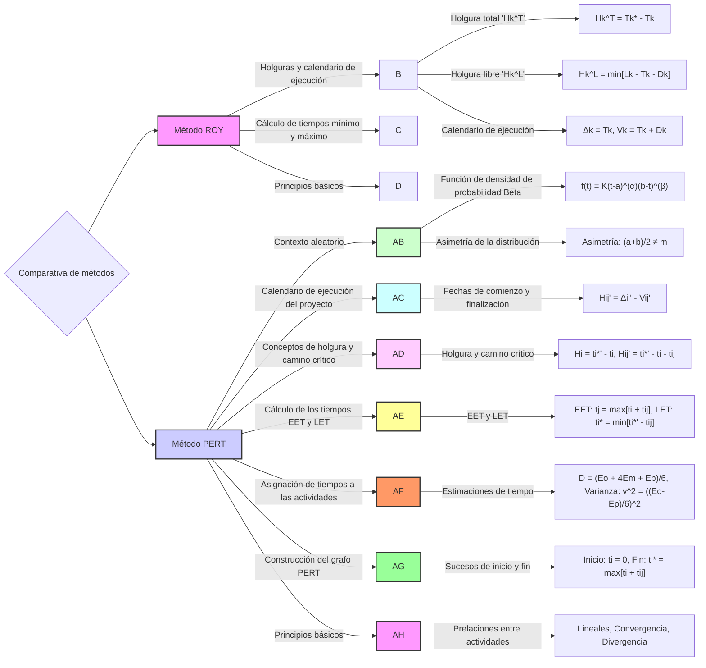

# Métodos de estimación del tiempo

## Diagrama con los métodos de estimación del tiempo

```mermaid

graph LR
    A[Método ROY] -->|Holguras y calendario de ejecución| B
    A -->|Cálculo de tiempos mínimo y máximo| C
    A -->|Principios básicos| D
    B -->|Holgura total 'Hk^T'| E["Hk^T = Tk* - Tk"]
    B -->|Holgura libre 'Hk^L'| F["Hk^L = min[Lk - Tk - Dk]"]
    B -->|Calendario de ejecución| G["Δk = Tk, Vk = Tk + Dk"]
 

    AA[Método PERT] -->|Contexto aleatorio| AB
    AA -->|Calendario de ejecución del proyecto| AC
    AA -->|Conceptos de holgura y camino crítico| AD
    AA -->|Cálculo de los tiempos EET y LET| AE
    AA -->|Asignación de tiempos a las actividades| AF
    AA -->|Construcción del grafo PERT| AG
    AA -->|Principios básicos| AH
    AB -->|Función de densidad de probabilidad Beta| AI["f(t) = K(t-a)^(α)(b-t)^(β)"]
    AB -->|Asimetría de la distribución| AJ["Asimetría: (a+b)/2 ≠ m"]
    AC -->|Fechas de comienzo y finalización| AK["Hij' = Δij' - Vij'"]
    AD -->|Holgura y camino crítico| AL["Hi = ti*' - ti, Hij' = ti*' - ti - tij"]
    AE -->|EET y LET| AM["EET: tj = max[ti + tij], LET: ti* = min[ti*' - tij]"]
    AF -->|Estimaciones de tiempo| AN["D = (Eo + 4Em + Ep)/6, Varianza: v^2 = ((Eo-Ep)/6)^2"]
    AG -->|Sucesos de inicio y fin| AO["Inicio: ti = 0, Fin: ti* = max[ti + tij]"]
    AH -->|Prelaciones entre actividades| AP["Lineales, Convergencia, Divergencia"]

    style A fill:#f9f,stroke:#333,stroke-width:2px
    style AA fill:#ccf,stroke:#333,stroke-width:2px
    style AB fill:#cfc,stroke:#333,stroke-width:2px
    style AC fill:#cff,stroke:#333,stroke-width:2px
    style AD fill:#fcf,stroke:#333,stroke-width:2px
    style AE fill:#ff9,stroke:#333,stroke-width:2px
    style AF fill:#f96,stroke:#333,stroke-width:2px
    style AG fill:#9f9,stroke:#333,stroke-width:2px
    style AH fill:#f9f,stroke:#333,stroke-width:2px

    Z{Comparativa de métodos} --> A
    Z --> AA
```
