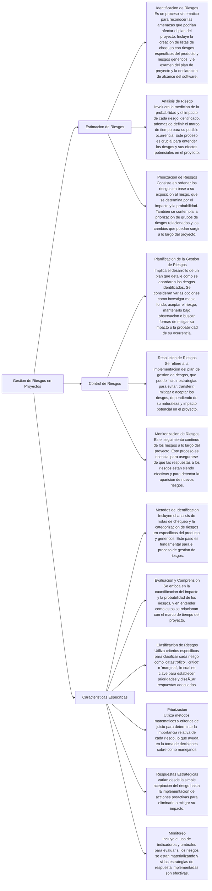

# Gestion de Riesgos en Proyectos

```mermaid
graph LR
    A[Gestion de Riesgos en Proyectos] --> B[Estimacion de Riesgos]
    A --> C[Control de Riesgos]
    A --> D[Caracteristicas Especificas]

    B --> B1[Identificacion de Riesgos<br>Es un proceso sistematico para reconocer las amenazas que podrian afectar el plan del proyecto. Incluye la creacion de listas de chequeo con riesgos especificos del producto y riesgos genericos, y el examen del plan de proyecto y la declaracion de alcance del software.]
    B --> B2[Analisis de Riesgo<br>Involucra la medicion de la probabilidad y el impacto de cada riesgo identificado, ademas de definir el marco de tiempo para su posible ocurrencia. Este proceso es crucial para entender los riesgos y sus efectos potenciales en el proyecto.]
    B --> B3[Priorizacion de Riesgos<br>Consiste en ordenar los riesgos en base a su exposicion al riesgo, que se determina por el impacto y la probabilidad. Tambien se contempla la priorizacion de grupos de riesgos relacionados y los cambios que puedan surgir a lo largo del proyecto.]

    C --> C1[Planificacion de la Gestion de Riesgos<br>Implica el desarrollo de un plan que detalle como se abordaran los riesgos identificados. Se consideran varias opciones como investigar mas a fondo, aceptar el riesgo, mantenerlo bajo observacion o buscar formas de mitigar su impacto o la probabilidad de su ocurrencia.]
    C --> C2[Resolucion de Riesgos<br>Se refiere a la implementacion del plan de gestion de riesgos, que puede incluir estrategias para evitar, transferir, mitigar o aceptar los riesgos, dependiendo de su naturaleza y impacto potencial en el proyecto.]
    C --> C3[Monitorizacion de Riesgos<br>Es el seguimiento continuo de los riesgos a lo largo del proyecto. Este proceso es esencial para asegurarse de que las respuestas a los riesgos estan siendo efectivas y para detectar la aparicion de nuevos riesgos.]

    D --> D1[Metodos de Identificacion<br>Incluyen el analisis de listas de chequeo y la categorizacion de riesgos en especificos del producto y genericos. Este paso es fundamental para el proceso de gestion de riesgos.]
    D --> D2[Evaluacion y Comprension<br>Se enfoca en la cuantificacion del impacto y la probabilidad de los riesgos, y en entender como estos se relacionan con el marco de tiempo del proyecto.]
    D --> D3[Clasificacion de Riesgos<br>Utiliza criterios especificos para clasificar cada riesgo como 'catastrofico', 'critico' o 'marginal', lo cual es clave para establecer prioridades y diseñar respuestas adecuadas.]
    D --> D4[Priorizacion<br>Utiliza metodos matematicos y criterios de juicio para determinar la importancia relativa de cada riesgo, lo que ayuda en la toma de decisiones sobre como manejarlos.]
    D --> D5[Respuestas Estrategicas<br>Varian desde la simple aceptacion del riesgo hasta la implementacion de acciones proactivas para eliminarlo o mitigar su impacto.]
    D --> D6[Monitoreo<br>Incluye el uso de indicadores y umbrales para evaluar si los riesgos se estan materializando y si las estrategias de respuesta implementadas son efectivas.]

```
