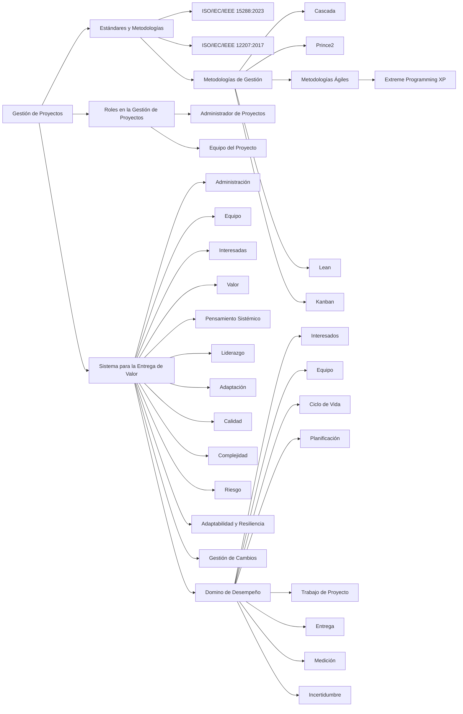

```mermaid
graph LR
    A[Gestión de Proyectos] --> B[Estándares y Metodologías]
    A --> C[Roles en la Gestión de Proyectos]
    A --> D[Sistema para la Entrega de Valor]
    
    B --> B1[ISO/IEC/IEEE 15288:2023]
    B --> B2[ISO/IEC/IEEE 12207:2017]
    B --> B3[Metodologías de Gestión]
    B3 --> B3A[Cascada]
    B3 --> B3B[Prince2]
    B3 --> B3C[Metodologías Ágiles]
    B3C --> B3C1[Extreme Programming XP]
    B3 --> B3D[Lean]
    B3 --> B3E[Kanban]

    C --> C1[Administrador de Proyectos]
    C --> C2[Equipo del Proyecto]

    D --> D1[Administración]
    D --> D2[Equipo]
    D --> D3[Interesadas]
    D --> D4[Valor]
    D --> D5[Pensamiento Sistémico]
    D --> D6[Liderazgo]
    D --> D7[Adaptación]
    D --> D8[Calidad]
    D --> D9[Complejidad]
    D --> D10[Riesgo]
    D --> D11[Adaptabilidad y Resiliencia]
    D --> D12[Gestión de Cambios]
    D --> D13[Domino de Desempeño]
    D13 --> D13A[Interesados]
    D13 --> D13B[Equipo]
    D13 --> D13C[Ciclo de Vida]
    D13 --> D13D[Planificación]
    D13 --> D13E[Trabajo de Proyecto]
    D13 --> D13F[Entrega]
    D13 --> D13G[Medición]
    D13 --> D13H[Incertidumbre]

```

